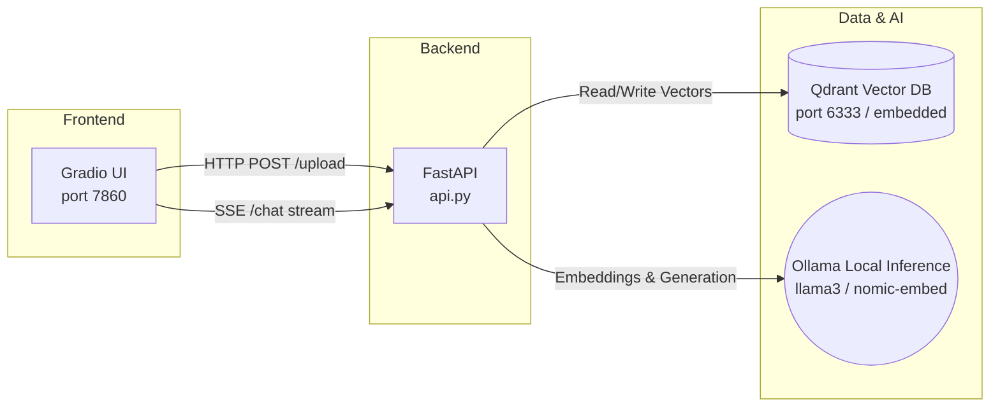

# ⬡ RAG Agent — Local, Production-Ready Setup

[](https://www.python.org/downloads/)
[](https://fastapi.tiangolo.com/)
[](https://gradio.app/)
[](https://ollama.com/)
[](https://opensource.org/licenses/MIT)

A **fully local, production-ready** Retrieval-Augmented Generation (RAG) agent.  
No API keys. No cloud dependencies. Private by default.

---

## 📑 Table of Contents
- [✨ Features](#-features)
- [🏗 Architecture](#-architecture)
- [📦 Technology Stack](#-technology-stack)
- [🚀 Quick Start (Local Setup)](#-quick-start-local-setup)
- [🐳 Docker Setup](#-docker-setup)
- [💻 Usage](#-usage)
- [⚙️ Configuration](#️-configuration)
- [🛠 Troubleshooting](#-troubleshooting)

---

## ✨ Features

- **100% Local**: Powered by Ollama (`llama3` for generation, `nomic-embed-text` for embeddings). Your data never leaves your machine.
- **Hybrid Retrieval**: Combines standard Dense Vector Search (cosine similarity) with BM25 Keyword Search for highly accurate document retrieval.
- **Reranking built-in**: Uses FlashRank (`ms-marco-MiniLM`) natively to score and surface the absolute best context chunks before passing them to the LLM.
- **Real-time Streaming**: Uses Server-Sent Events (SSE) to stream the LLM's response to the frontend instantly, token-by-token.
- **Modern UI**: A sleek, dark-terminal Gradio interface with persistent file management.
- **Persistent Storage**: Qdrant vector database runs locally and persists data automatically.

---

## 🏗 Architecture



**Retrieval Pipeline:**
> 1. Query ➡️ **Dense Vector Search** + **BM25 Keyword Search** 
> 2. Merge Results ➡️ **FlashRank Reranker** 
> 3. Top-N Chunks ➡️ **Prompt Injection** ➡️ **LLM Generation**

---

## 📦 Technology Stack

| Layer | Technology Used |
| :--- | :--- |
| **Frontend / UI** | [Gradio 6.x](https://gradio.app/) |
| **Backend API** | [FastAPI](https://fastapi.tiangolo.com/) + SSE Streaming |
| **Agent Orchestration** | [LangGraph](https://python.langchain.com/docs/langgraph) / LangChain |
| **Language Model (LLM)**| [Ollama (`llama3:8b`)](https://ollama.com/library/llama3) |
| **Embedding Model** | [Ollama (`nomic-embed-text`)](https://ollama.com/library/nomic-embed-text) |
| **Vector Store** | [Qdrant](https://qdrant.tech/) (Configurable as embedded or containerized) |
| **Reranker** | [FlashRank](https://github.com/PrithivirajDamodaran/FlashRank) (`ms-marco-MiniLM-L-12-v2`) |

---

## 🚀 Quick Start (Local Setup)

### 1. Prerequisites
You need [Ollama](https://ollama.com/download) installed and running on your machine.
```bash
# Pull the required local models
ollama pull llama3:8b
ollama pull nomic-embed-text
```

### 2. Python Environment Setup
```bash
# Clone the repo and navigate to the folder
python3 -m venv venv

# Activate the virtual environment
source venv/bin/activate       # macOS/Linux
# .\venv\Scripts\activate      # Windows

# Install dependencies
pip install -r requirements.txt
```

### 3. Configuration
Copy the template configuration file.
```bash
cp .env.example .env
```
> **Note on Qdrant:** By default, `.env` attempts to connect to a Dockerized Qdrant instance. If you do not have Docker installed, you can easily use **Embedded Mode** (where Qdrant runs inside Python). To do this, edit `.env` and leave the URL empty:
> `QDRANT_URL=`

### 4. Start the Application

**Terminal 1 (Backend):**
```bash
source venv/bin/activate
uvicorn api:app --reload --port 8000
```
> Wait until you see `INFO: agent:__init__:107 - RAGAgent ready`. Check health at [http://localhost:8000/health](http://localhost:8000/health)

**Terminal 2 (Frontend):**
```bash
source venv/bin/activate
python app.py
```
> The UI will be available at [http://localhost:7860](http://localhost:7860)

---

## 🐳 Docker Setup

For a true "one-click" experience, use Docker Compose. This starts Qdrant, Ollama, the FastAPI backend, and the Gradio UI together.

```bash
docker compose up -d
```
*Note: Qdrant data and Ollama models are mapped to persistent Docker volumes automatically.*

---

## 💻 Usage

1. **Open the UI:** Navigate to `http://localhost:7860`.
2. **Upload Documents:** Click "Upload PDF / TXT / MD" in the sidebar and select your documents.
3. **Index:** Click the **⬆ Index Files** button. Wait for the success notification.
4. **Chat:** Ask questions in the chat box! The agent will retrieve relevant information from your uploaded context and stream the answer back to you.

---

## ⚙️ Configuration

Tune your setup by modifying the `.env` file. All settings are managed centrally via `config.py`.

| Parameter | Default | Description |
| :--- | :--- | :--- |
| `OLLAMA_MODEL` | `llama3:8b` | The LLM to use for generation. |
| `EMBED_MODEL` | `nomic-embed-text`| Model used to generate vectors. |
| `QDRANT_URL` | `http://localhost:6333`| Leave empty (`""`) to use local-embedded mode. |
| `CHUNK_SIZE` | `800` | Tokens per document chunk. |
| `RETRIEVAL_TOP_K` | `20` | Max candidate chunks fetched before reranking. |
| `RERANK_TOP_N` | `4` | Final number of chunks passed to the LLM. |

---

## 🛠 Troubleshooting

**"Connection Error: Qdrant is not running"**
Ensure Qdrant is running via Docker, OR edit `.env` and set `QDRANT_URL=` (empty string) to force Qdrant to run locally using the `./qdrant_storage` folder.

**"Client error: 422 Unprocessable Content for url /chat"**
This project requires the `app.py` UI logic to correctly format messages for the FastAPI endpoint. If you update Gradio to version `6.x+`, the message payload structure changes internally from strings to a list of dicts. If you encounter this, ensure you are running the latest version of `app.py` which contains the `_text()` extraction helper to gracefully handle Gradio 6.x strict message structures.

**Ollama Connection Refused**
Ensure the Ollama application is running in the background. You can test it by running `curl http://localhost:11434` in your terminal.

---

## 🧪 Testing

```bash
pip install pytest pytest-asyncio
pytest tests/ -v
```
